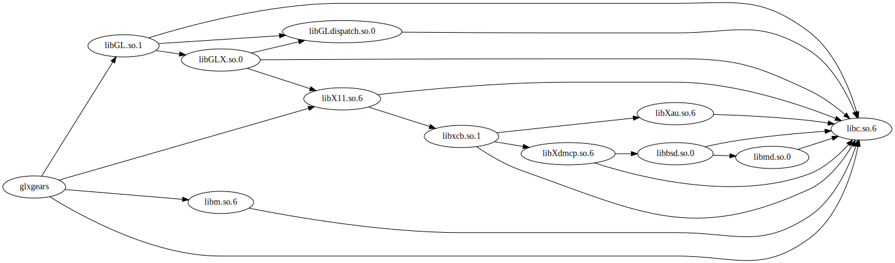

# sotrace
Traces the shared-object dependencies of a binary, and graphs them.

## Usage

```
./sotrace.py /path/to/foo out.dot
dot -Tout.svg out.dot
eog out.svg
```



## Rationale

Dynamically linked binaries pull in a large amount of dependencies.
It is often hard to get a good idea of what gets pulled in, recursively.

This tool will create a graphic that clearly shows the dependencies.

It is also a useful tool to identify software bloat.

## Limitations

Currently, it will only find dependencies that are dynamically linked.

This means it will miss:
 * statically linked dependencies.
 * plugins (.so files that are loaded at run-time, not load-time.)

## Author

Bram Stolk b.stolk@gmail.com

